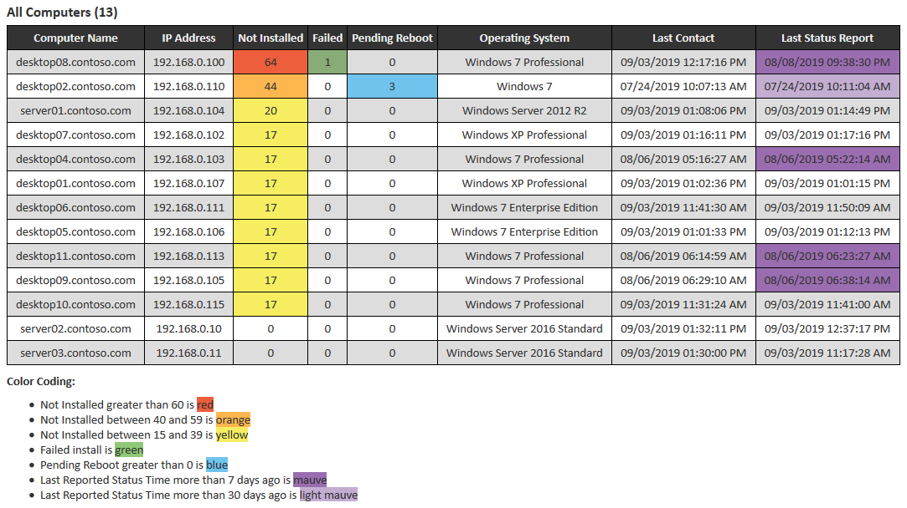
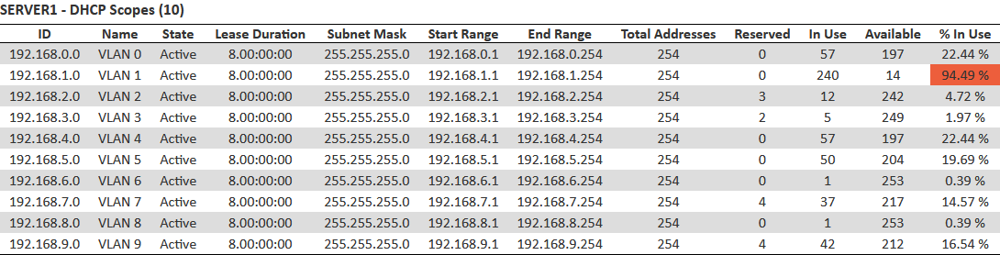
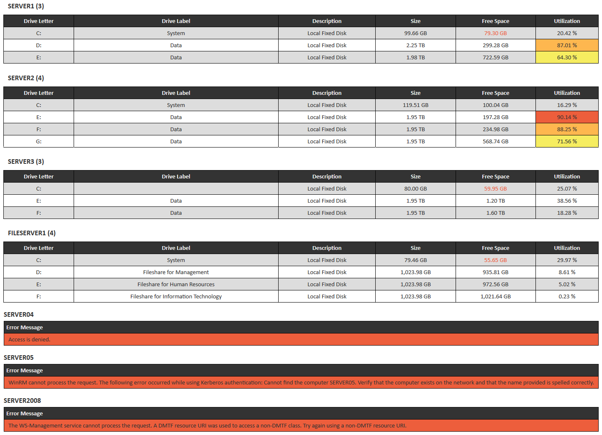
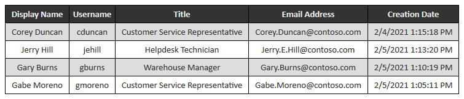
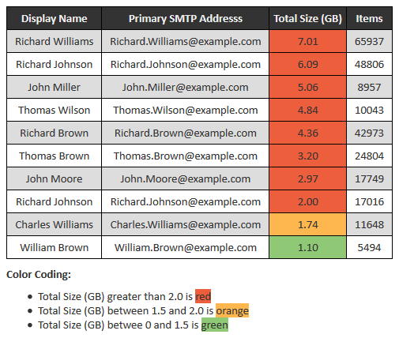

PSHTMLTable
===========

PowerShell module to generate HTML tables from an object or list and add inline CSS to them on demand.

This module is a modified version of HTMLTable / PSHTMLTable originally developed by Warren Frame ("RamblingCookieMonster"). It has been enhanced to include the following additional features:

    * Ability to compare 2 cells within the same row and add CSS attributes to cell, reference cell, or the entire row
    * Ability to add any CSS attributes to tables and id and class tags to rows, and cells
    * Ability to nest multiple tables within a single container table
    * Ability to use "HtmlDecode" on a per table or global page basis
    * Ability to format cells after evaluation
    * Ability to remove "<colgroup></colgroup>" tag
    * Ability to add "<thead></thead>", "<tbody></tbody>", and "<tfoot></tfoot>" tags
    *	Updated version number to 1.0.0.0 to avoid conflicts with predecessor
    * Original parameter names can be used for backwards compatibility, see ** BREAKING CHANGE **
    * Separated code from examples to keep code cleaner
    * Theme support
    * Pester Tests

    ** BREAKING CHANGE **
    New-HTMLTable Parameters -HTMLDecode and -SetAlternating have been changed to Switch type instead of Boolean type.
    If you are a previous user to PSHTMLTable and you're switching to this version, you'll need to replace -HTMLDecode $true and -SetAlternating $true to -HTMLDecode and -SetAlternating.
    Alternatively, if you use -HTMLDecode $false or -SetAlternating $false you can remove them.

## Functions

    You can use and combine several functions to create complete HTML pages:

    * New-HTMLHead - Starts building the HTML document and includes internal CSS, specified CSS, or theme (leaves body, html tags open)
    * New-HTMLTable - Creates an HTML table from one or more objects
    * Add-HTMLTableColor - Colorize cells or rows in an HTML table, or add other inline CSS based on user defined criteria
    * Close-HTML - Close out the body and html tags
    * ConvertTo-HTMLPropertyValue - Convert an object with various properties into an array of property, value pairs

    New-HTMLTable just creates a table, not the full HTML around it, thus allowing you to build multiple tables per page.

## Installation

```powershell
# Download the repository
# Unblock the zip
# Extract the PSHTMLTable folder to a module path (e.g. $env:USERPROFILE\Documents\WindowsPowerShell\Modules\)

# Import the module.
    Import-Module $env:USERPROFILE\Documents\WindowsPowerShell\Modules\PSHTMLTable

# Get commands in the module
    Get-Command -Module PSHTMLTable
```

## Examples

### Get-WSUSClientStatus.ps1
Connects to a WSUS Server and displays the status of all of its clients.

```powershell
# Create HTML document and display it via the default browser
.\Get-WSUSComputerStatus.ps1 -ComputerName "server01.contoso.com" -WSUSPort 8531 -UseSSL $true | Out-File $env:TEMP\WSUSClientStatus.html
Start-Process $env:TEMP\WSUSClientStatus.html

# Create HTML and email it
.\Get-WSUSComputerStatus.ps1 -ComputerName "server01.contoso.com" -WSUSPort 8531 -UseSSL $true -SendEmail -FromAddress John.Doe@contoso.com -ToAddress John.Doe@contoso.com -SMTPServer "mail.contoso.com" -SMTPPort 25
```

[](Images/Get-WSUSComputerStatus.png)

### Get-DhcpScopeUsage.ps1

Displays DHCP Scope information from a DHCP Server using inline custom CSS.
```powershell
# Create HTML document and display it via the default browser
.\Get-DhcpScopeUsage.ps1 -ComputerName "SERVER1" | Out-File $env:TEMP\DhcpScopeUsage.html
Start-Process $env:TEMP\DhcpScopeUsage.html
```

[](Images/Get-DhcpScopeUsage.png)

### Get-DiskUsage.ps1

Displays disk information from a Server or Servers. Uses Get-CimInstance to query Server(s).
```powershell
# Create HTML document and display it via the default browser
.\Get-DiskUsage.ps1 -ComputerName "SERVER1", "SERVER2" | Out-File $env:TEMP\DiskUsage.html
Start-Process $env:TEMP\DiskUsage.html
```

[](Images/Get-DiskUsage.png)

### Get-RecentADUsers.ps1

Displays users from Active Directory that were created within X days.
```powershell
# Create HTML document and display it via the default browser
.\Get-RecentADUsers.ps1 -NumberOfDays 1 | Out-File $env:TEMP\RecentADUsers.html
Start-Process $env:TEMP\RecentADUsers.html

# Create HTML and email it
.\Get-RecentADUsers.ps1 -NumberOfDays 1 -SendEmail -FromAddress John.Doe@contoso.com -ToAddress John.Doe@contoso.com -SMTPServer "mail.contoso.com" -SMTPPort 25
```

[](Images/Get-RecentADUsers.png)

### Get-WindowsEvents.ps1

Displays Event Log entries from the local computer.
```powershell
# Create HTML document and display it via the default browser
.\Get-WindowsEvents.ps1 | Out-File $env:TEMP\WindowsEvents.html
Start-Process $env:TEMP\WindowsEvents.html
```

### Get-MailboxUsage.ps1

Displays Mailbox usage for users.
```powershell
# Create HTML document and display it via the default browser
.\Get-MailboxUsage.ps1 | Out-File $env:TEMP\MailboxUsage.html
Start-Process $env:TEMP\MailboxUsage.html
```

[](Images/Get-MailboxUsage.png)
